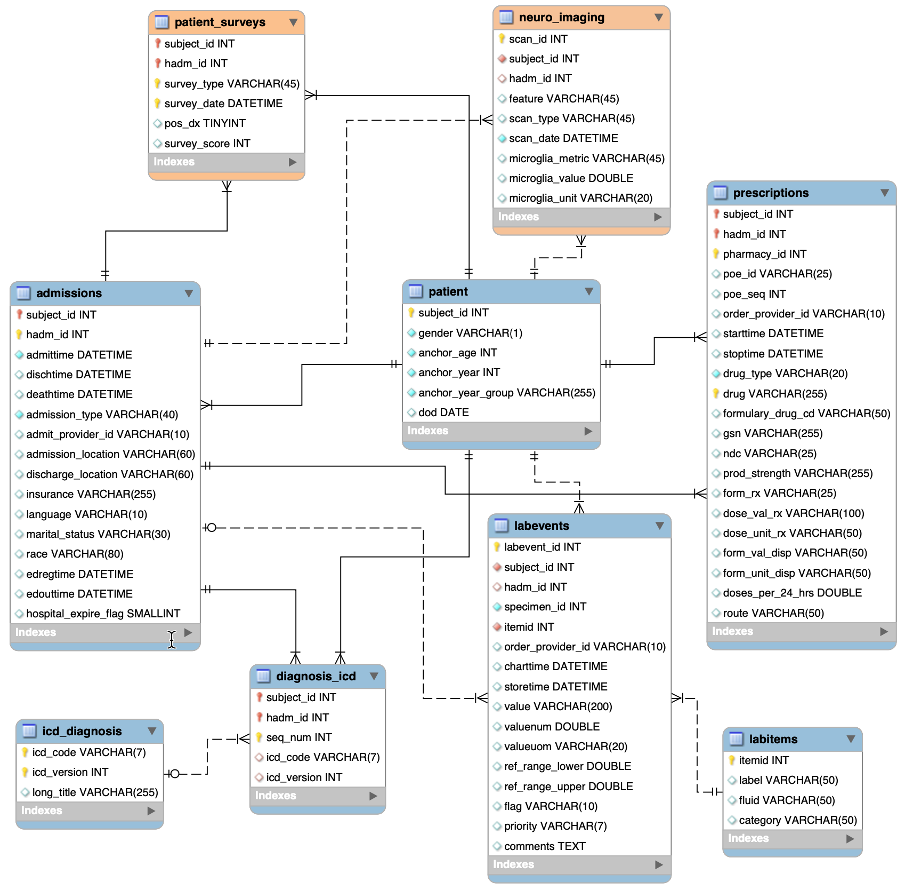

# mental-health-biomarker-relational-db
This project implements a relational clinical research database in MySQL, integrating multimodal mental health data including patient demographics, admissions, laboratory biomarkers, diagnoses, survey assessments, and neuroimaging features. Built using a subset of MIMIC-IV data with supplementary schema extensions, the system enables structured querying of biomarker–diagnosis relationships and supports scalable analytical workflows in mental health research.

## Database Architecture

## Core Entities

The database is structured around the following primary entities:

- **patient** – demographic and anchor information
- **admissions** – hospitalization events linked to each patient
- **diagnosis_icd / icd_diagnosis** – coded diagnoses using ICD-9/10 standards
- **labevents / labitems** – laboratory measurements including biomarkers (e.g., cortisol, immunoglobulin A)
- **prescriptions** – medication records associated with hospital admissions
- **patient_surveys** – standardized mental health assessments (e.g., GAD-7, PHQ-9)
- **neuro_imaging** – imaging-derived features such as microglial activation metrics
